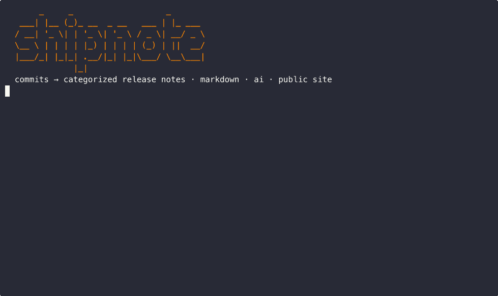

# shipnote

<p align="center">
  
</p>

> Release intelligence for SDK and developer-platform teams. CLI-first, CI-native, OSS.

**shipnote** turns your repository's PRs, labels, tags, and monorepo structure into deterministic, audience-targeted release notes you can trust in CI. Optional AI polish runs locally — never required.

> ⚠️ **Status: pre-alpha.** v0.1 is in active development. Schema is being stabilized; expect breaking changes until v1.0.

## Why

Most changelog tools generate from commits. Commits are the wrong unit. Pull requests, packages, and tags are the real units of change. shipnote treats them as such, and emits a structured `release.json` alongside human-readable markdown — so the same data can power a `CHANGELOG.md`, a docs page, search, or any downstream tool.

## Install

```bash
# Homebrew (coming soon)
brew install DesmondSanctity/tap/shipnote

# Go
go install github.com/DesmondSanctity/shipnote/cmd/shipnote@latest

# Binary releases: see https://github.com/DesmondSanctity/shipnote/releases
```

## 60-second quickstart

```bash
cd your-repo
shipnote init                       # writes .shipnote.toml, adds .shipnote/ to .gitignore
shipnote generate --from v1.0.0     # produces CHANGELOG.md and .shipnote/release.json
shipnote generate --check           # CI-safe: fails if regen would change output
```

## Optional: AI summaries

Add `--ai` to enrich `release.json` with audience-keyed prose (developer, customer, migration). The Markdown body is unchanged — AI is additive and never blocks a release.

### Quick start by provider

| Provider  | `--ai-provider`    | Auth                                                                        | Default model             | Notes                                             |
| --------- | ------------------ | --------------------------------------------------------------------------- | ------------------------- | ------------------------------------------------- |
| Ollama    | `ollama`           | none (local)                                                                | `llama3.2:1b`             | Reads `OLLAMA_HOST` (default `localhost:11434`).  |
| OpenAI    | `openai`           | `OPENAI_API_KEY` env or `--ai-key`                                          | `gpt-4o-mini`             | Hosted.                                           |
| Anthropic | `anthropic`        | `ANTHROPIC_API_KEY` env or `--ai-key`                                       | `claude-3-5-haiku-latest` | Native Messages API.                              |
| Groq      | `groq`             | `GROQ_API_KEY` env or `--ai-key`                                            | `llama-3.1-8b-instant`    | Hosted, fast free tier.                           |
| Custom    | `custom`           | `--ai-key` (if endpoint requires it)                                        | none — set `--ai-model`   | Any OpenAI-compatible `/v1/chat/completions` API. |
| Auto      | `auto` _(default)_ | first of `OPENAI_API_KEY`, `ANTHROPIC_API_KEY`, `GROQ_API_KEY`, then Ollama | provider default          | Zero-config: pick whatever's available.           |

### Examples

```bash
# Auto-detect (recommended for local dev)
shipnote generate --ai

# Local Ollama with a specific model
shipnote generate --ai --ai-provider ollama --ai-model llama3.1:8b
shipnote generate --ai --ai-provider ollama --ai-model qwen2.5:7b
shipnote generate --ai --ai-provider ollama --ai-model mistral:7b

# OpenAI
export OPENAI_API_KEY=sk-...
shipnote generate --ai --ai-provider openai --ai-model gpt-4o-mini
shipnote generate --ai --ai-provider openai --ai-model gpt-4o

# Anthropic (Claude) — native API
export ANTHROPIC_API_KEY=sk-ant-...
shipnote generate --ai --ai-provider anthropic                              # default claude-3-5-haiku-latest
shipnote generate --ai --ai-provider anthropic --ai-model claude-3-5-sonnet-latest
shipnote generate --ai --ai-provider anthropic --ai-model claude-3-opus-latest

# Groq
export GROQ_API_KEY=gsk_...
shipnote generate --ai --ai-provider groq --ai-model llama-3.3-70b-versatile
shipnote generate --ai --ai-provider groq --ai-model mixtral-8x7b-32768
```

### Custom: any OpenAI-compatible endpoint

`--ai-provider custom` works with anything that exposes `POST /v1/chat/completions` and `GET /v1/models`. Verified targets:

- **OpenRouter** — `--ai-base-url https://openrouter.ai/api/v1 --ai-key $OPENROUTER_KEY`
- **Together AI** — `--ai-base-url https://api.together.xyz/v1 --ai-key $TOGETHER_KEY`
- **vLLM** — `--ai-base-url http://your-host:8000/v1`
- **LM Studio** — `--ai-base-url http://localhost:1234/v1`
- **LocalAI** — `--ai-base-url http://localhost:8080/v1`
- **DeepSeek, Mistral La Plateforme, Fireworks, Anyscale, Perplexity** — all OpenAI-shape; pass their base URL + key.

```bash
shipnote generate --ai \
  --ai-provider custom \
  --ai-base-url https://openrouter.ai/api/v1 \
  --ai-key $OPENROUTER_KEY \
  --ai-model anthropic/claude-3.5-sonnet
```

### All AI flags

| Flag            | Purpose                                                              |
| --------------- | -------------------------------------------------------------------- |
| `--ai`          | Enable AI enrichment.                                                |
| `--ai-provider` | `auto` (default), `openai`, `anthropic`, `groq`, `ollama`, `custom`. |
| `--ai-model`    | Override the provider's default model.                               |
| `--ai-base-url` | Override base URL (mainly for `custom`).                             |
| `--ai-key`      | API key. Falls back to provider's env var.                           |

### Caching & determinism

Results are cached at `.shipnote/cache/ai/<aa>/<sha256>.json` keyed by provider, model, prompt version, audience, scope, and the canonical fact set. Re-runs with no upstream changes are zero-network. Prompts are versioned (`promptVersion: "v1"`) — bumping a prompt invalidates old entries automatically. The Markdown body is rendered **before** AI runs, so disabling AI never changes the canonical changelog.

See [docs/ai.md](docs/ai.md) for the JSON output schema.

## Public changelog page

`shipnote site` builds a static, multi-version HTML changelog you can drop on any host (GitHub Pages, S3, Netlify, Cloudflare Pages):

```sh
shipnote site public/changelog \
  --site-url https://acme.com/changelog \
  --site-title "Acme changelog"
```

The output is self-contained and idempotent — re-running with the same input produces byte-identical files:

```
public/changelog/
  index.html              # latest release + sidebar of every version
  v0.2.0/index.html       # one page per release
  v0.1.0/index.html
  feed.json               # JSON Feed 1.1 (with a _shipnote vendor extension)
  feed.xml                # Atom feed for RSS readers
  releases.json           # internal index — keep in source control
  assets/site.css
  assets/widget.js
```

### Embed on your site

Drop two lines into any page and you have a "What's new" panel that pulls from the JSON Feed:

```html
<div id="shipnote"></div>
<script
 src="https://acme.com/changelog/assets/widget.js"
 data-feed="https://acme.com/changelog/feed.json"
 data-mount="#shipnote"
 data-limit="5"
 data-audience="customer"
></script>
```

The widget is dependency-free vanilla JS, ~3 KB, and renders the latest N releases with stats pills and customer summaries. Pass `data-stylesheet="..."` to override the default styles, or `data-audience="developer"` for engineering-facing copy.

## What's in the box (v0.1)

- `git` + `github-prs` source adapters with PR/commit dedup
- Categorization via PR labels, Conventional Commits, and `changelog:` PR-body blocks
- Breaking-change detection (CC `!`, `BREAKING CHANGE:` footer, `breaking` label)
- Markdown + JSON renderers, schema v1.0.0
- Deterministic output, `--check` mode for CI
- **Optional** audience-aware AI summaries (OpenAI, Anthropic, Groq, Ollama, custom)
- Static **public changelog site** + JSON Feed / Atom + embeddable widget

Out of scope until later versions: monorepo support, GitHub Action. See [docs/roadmap.md](docs/roadmap.md) for the full plan.

## License

[Apache-2.0](LICENSE).

```
       _     _                   _
   ___| |__ (_)_ __  _ __   ___ | |_ ___
  / __| '_ \| | '_ \| '_ \ / _ \| __/ _ \
  \__ \ | | | | |_) | | | | (_) | ||  __/
  |___/_| |_|_| .__/|_| |_|\___/ \__\___|
              |_|  release intelligence
```
